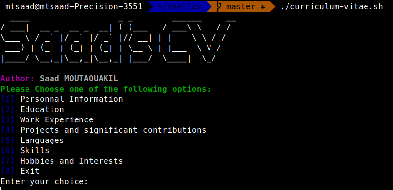

# An interactive shell Curriculum Vitae

## Author : <h style="color : skyblue;"> Saad Moutaouakil </h>
***
## Prerequisites 

Any system capable of running sh files can run the CV using its terminal.
Windows users can run it using Linux subsystem (or any tool providing bash command-line : Cygwin, Git Bash...)

## Motivations 

The main goal is to provide a new way to look into curriculums using one of (if not the most used tool) the most used tools of any programmer in Linux : Bash.

## Usage 

You just have to run the script using : 
```sh
./curriculum-vitae.sh
```
Tested with zsh and bash



***